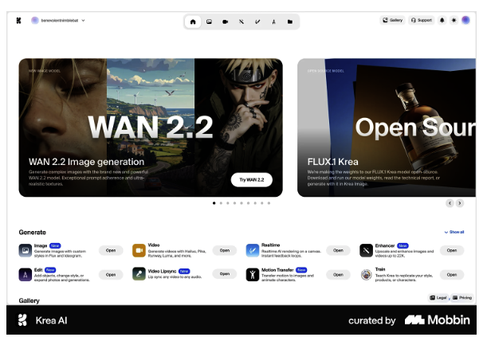
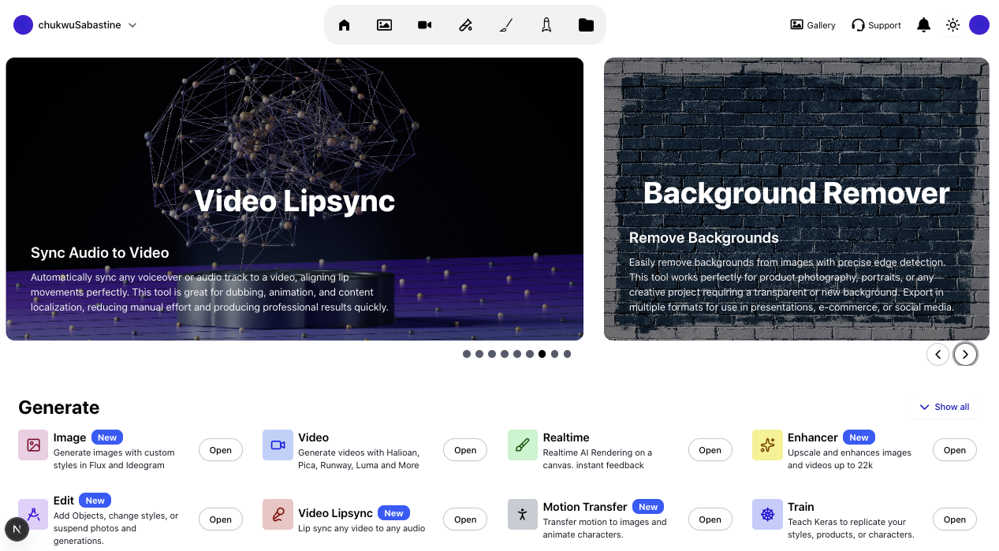

# Cartolinks Internship Application – Frontend

This project is part of the **Tech Internship Application** for **Frontend**.  
The assignment was to **recreate the provided design pixel-perfect** using **Next.js, TypeScript, Tailwind CSS**, and implement a **dark/light mode toggle**.  

## 📸 Screenshot




---

## 🚀 Tech Stack

- **Next.js 13+ (App Router)** – React framework for server-side rendering and routing  
- **TypeScript** – Strongly typed development for maintainability  
- **Tailwind CSS** – Utility-first CSS framework for rapid UI building  
- **shadcn/ui** – Accessible and composable UI components  
- **React Hooks** – State and lifecycle management  
- **Dark/Light Mode** – Implemented using `next-themes`  

---

## ✨ Features

- 🎨 **Pixel-perfect UI** matching the provided design  
- 🌗 **Dark/Light mode toggle** with smooth transitions  
- 📱 **Fully responsive** across devices (mobile-first design)  
- ♻️ **Reusable components** (carousel, cards, buttons, etc.)  
- ⚡ **Optimized performance** with Next.js image optimization and dynamic imports  
- 🧩 **Clean architecture** with separation of concerns (components, constants, hooks)  


## ✅ Requirements Met

- Pixel-perfect UI based on provided design  
- Dark/light mode toggle  
- Next.js + TypeScript + Tailwind stack  
- Reusable components  
- Responsive layout  

## 📸 Completed UI




## 🛠️ Getting Started

### 1. Clone the repository

```bash
git clone https://github.com/your-username/tech-internship-assignment.git

cd tech-internship-assignment

npm install

